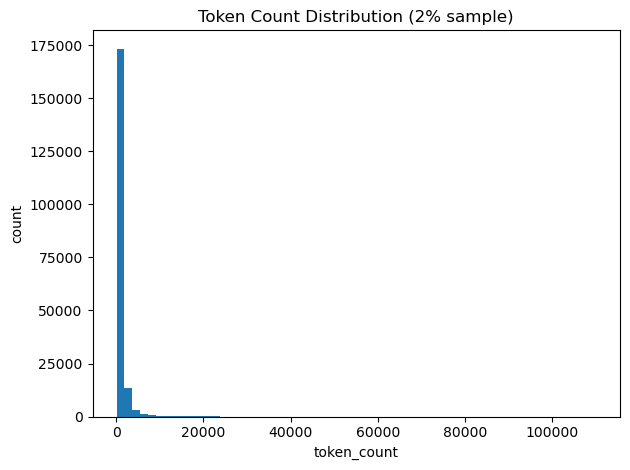

# FineWeb-Edu Large-Scale Analysis with Apache Spark

## Project Description

This project analyzes the FineWeb-Edu (Sample-10BT) dataset using Apache Spark on SDSC Expanse High-performance computing (HPC). We explore 9.67 million educational web documents to understand data characteristics, quality distributions, and develop preprocessing strategies for educational content classification.

---

## Dataset

We use the [FineWeb-Edu Sample-10BT](https://huggingface.co/datasets/HuggingFaceFW/fineweb-edu/viewer/sample-10BT) dataset from [HuggingFace](https://huggingface.co/datasets/HuggingFaceFW/fineweb-edu).

The dataset contains **9,672,101 educational web documents** stored in **14 Parquet files**.  
Data is processed using Apache Spark on SDSC Expanse due to its distributed format and scale.

---

## SDSC Expanse Setup

All work is performed on the SDSC Expanse high-performance computing cluster.

**Hardware Configuration:**

- **CPU Cores:** 8
- **Memory:** 128 GB per node

---

## SparkSession Configuration

```python
spark = SparkSession.builder \
    .config("spark.driver.memory", "2g") \
    .config("spark.executor.memory", "15g") \
    .config("spark.executor.instances", 7) \
    .getOrCreate()
```

### Justification

**Executor instances** = Total Cores - 1 = 8 - 1 = 7

**Executor memory** = (Total Memory - Driver Memory) / Executor Instances  
= (128GB - 2GB) / 7 ≈ 18GB

Executor memory was set to 15GB to allow memory overhead for Spark and JVM processes and to prevent out-of-memory errors.

### Spark UI Screenshot

Below is the Spark UI showing multiple executors active during data loading:


---

## Data Exploration

### Number of Observations

The dataset contains **9,672,101 documents** in the FineWeb-Edu Sample-10BT subset.

---

### Column Descriptions

| Column           | Type    | Description          | Scale / Distribution   |
| ---------------- | ------- | -------------------- | ---------------------- |
| `id`             | string  | Document ID          | Unique identifier      |
| `text`           | string  | Document content     | Variable length        |
| `url`            | string  | Source URL           | Diverse domains        |
| `language`       | string  | Language             | Predominantly English  |
| `language_score` | float   | Language confidence  | 0–1 (mostly >0.95)     |
| `token_count`    | integer | Token count          | 1–170K, median ~629    |
| `score`          | float   | Quality score        | 2.5–5.34, median ~2.9  |
| `int_score`      | integer | Binned quality score | Buckets 3–5 (mostly 3) |

---

### Variable Types

- **Categorical variables:** `language`, `url`
- **Continuous variables:** `language_score`, `token_count`, `score`
- **Identifier column:** `id`
- **Target variable (planned):** `score` / `int_score` (educational quality)

---

### Missing and Duplicate Values

- No null values detected in core columns
- No duplicate records based on `id`
- Dataset is clean and suitable for modeling

---

### Distribution Insights

- **Token count** is highly right-skewed with median ~629 and mean ~1031 tokens, extending up to 170K tokens. This indicates high variability in document length.
- **Quality score** is moderately right-skewed, ranging from 2.5 to 5.34 with median ~2.9 and mean ~3.0. Most documents fall in quality bucket 3, with fewer in bucket 5.
- **Language distribution** is strongly dominated by English content.
- **Domain distribution** shows exceptional diversity with over 2 million unique sources. Top domains (Wikipedia, Britannica) each represent <1% of the total dataset.

---

### Spark Operations Used

The following Spark DataFrame operations were used:

- `df.count()` — Total observation count
- `df.printSchema()` — Schema inspection
- `df.describe().show()` — Summary statistics
- `df.groupBy().agg()` — Aggregations by quality bucket
- `df.select().distinct().count()` — Unique domain counts
- `df.dropDuplicates()` — Duplicate detection

---

## Data Visualizations

The complite soursecode is in the following notebook [01_data_exploration.ipynb](notebooks/01_data_exploration.ipynb).

### 1. Documents per Quality Bucket (Bar Chart)


The majority of documents fall into quality bucket 3 (86.7%), followed by bucket 4 (13.2%), with very few in bucket 5 (0.08%). This confirms a severe class imbalance that must be considered during model training.

### 2. Top Domains (Bar Chart)

**Unique Domains:** 2,088,546


The dataset exhibits exceptional domain diversity with over 2 million unique sources. Top domains include educational websites (Wikipedia, Britannica), science news (Phys.org, ScienceDaily), and academic resources. Even the top domain (Wikipedia) represents <1% of total documents, confirming no single source dominates the dataset.

### 3. Token Count Distribution (Histogram)

**Note:** While the full dataset contains 9.6M documents, the visualizations below utilize a random 2% sample (~193K documents) to maintain performance while accurately representing the data distribution.



The token count distribution is heavily right-skewed. The median document length is ~629 tokens, while the mean (~1031 tokens) is larger due to a long tail extending up to 170K tokens. This indicates high variability in document length and suggests potential filtering or normalization during preprocessing.

### 4. Quality Score Distribution (Histogram)


The quality score ranges from approximately 2.5 to 5.34, with a median of ~2.9 and mean ~3.0. The distribution is moderately right-skewed, with most documents concentrated in the lower-to-mid score range (int_score = 3). Very high-quality documents (score bucket 5) are relatively rare.

---

## Preprocessing Plan

- **Filter invalid documents:** Use `df.filter()` to remove null or empty text fields, documents with fewer than 50 tokens, and documents shorter than 200 characters to reduce noise.

- **Remove duplicates:** Apply `dropDuplicates(["id"])` to ensure unique documents.

- **Feature engineering:** Extract domain names from URLs and create length-based categories from token_count.

- **Normalization:** Scale numeric features such as token_count and score to the [0,1] range using Spark ML preprocessing tools.

- **Handle class imbalance:** Since 86.7% of documents fall into quality bucket 3, we will consider stratified sampling or class weighting during model training.

- **Encoding:** Apply `StringIndexer` and `OneHotEncoder` to categorical variables if used in modeling.

---

## Quick Setup

```bash

git clone https://github.com/mn-cs/fineweb-spark
cd fineweb-spark

```

---

## Documentation

- [Collaboration Guide](docs/COLLABORATION.md) - Team workflow and git instructions
