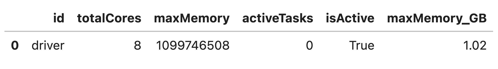
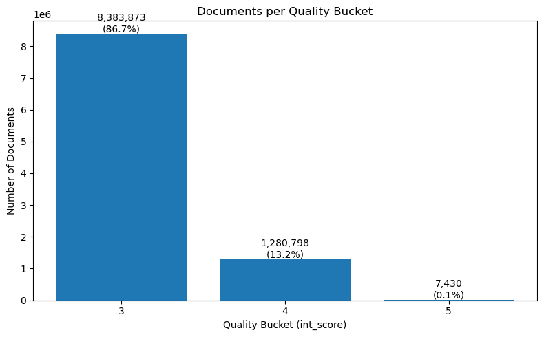
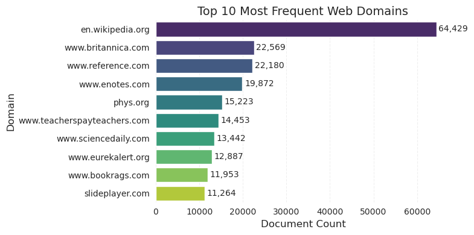
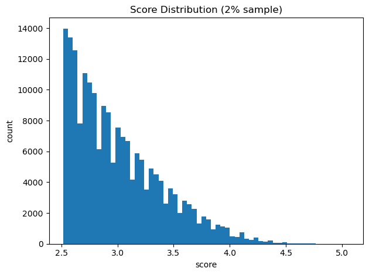

# FineWeb-Edu Large-Scale Analysis with Apache Spark

[](https://www.python.org/)
[](https://spark.apache.org/)
[](https://pandas.pydata.org/)
[](https://matplotlib.org/)
[](https://seaborn.pydata.org/)

## Introduction

The web contains vast amounts of educational content, but its quality varies enormously. The FineWeb-Edu dataset assigns quality scores to nearly 10 billion tokens of web text, making it one of the largest educational content corpora available. This project trains a distributed classifier to predict those quality scores — effectively automating the judgment of whether a web document is educationally valuable.

A reliable educational quality predictor has broad real-world impact: it can drive smarter dataset curation for training large language models, power content recommendation systems for students, and help researchers filter high-quality sources at scale.

**Why this requires big data and distributed computing:**
The FineWeb-Edu Sample-10BT subset alone contains **9.67 million documents** across 14 Parquet files. Loading, filtering, featurizing (Word2Vec over millions of documents), and training Random Forest models on this data is impractical on a single machine — it would take hours just to read the data, let alone train. Apache Spark on SDSC Expanse allows all of these steps to run in parallel across 32 cores, reducing training time from hours to seconds. Without Spark/Ray, the full pipeline would be computationally infeasible.

**Notebook:** [notebooks/01-exploration.ipynb](notebooks/01-exploration.ipynb)

---

## Dataset

We use the [FineWeb-Edu Sample-10BT](https://huggingface.co/datasets/HuggingFaceFW/fineweb-edu/viewer/sample-10BT) dataset from [HuggingFace](https://huggingface.co/datasets/HuggingFaceFW/fineweb-edu).

The dataset contains **9,672,101 educational web documents** stored in **14 Parquet files**.  
Data is processed using Apache Spark on SDSC Expanse due to its distributed format and scale.

---

## SDSC Expanse Setup

All work is performed on the SDSC Expanse high-performance computing cluster.

**Hardware Configuration:**

- **CPU Cores:** 8
- **Memory:** 128 GB per node

---

## SparkSession Configuration

```python
spark = SparkSession.builder \
    .config("spark.driver.memory", "2g") \
    .config("spark.executor.memory", "15g") \
    .config("spark.executor.instances", 7) \
    .getOrCreate()
```

### Justification

**Executor instances** = Total Cores - 1 = 8 - 1 = 7

**Executor memory** = (Total Memory - Driver Memory) / Executor Instances  
= (128GB - 2GB) / 7 ≈ 18GB

Executor memory was set to 15GB to allow memory overhead for Spark and JVM processes and to prevent out-of-memory errors.

### Spark UI Screenshot

Below is the DataFrame output showing multiple executors active during data loading:



---

## Data Exploration

**Notebook:** [notebooks/01-exploration.ipynb](notebooks/01-exploration.ipynb)

---

### Number of Observations

The dataset contains **9,672,101 documents** in the FineWeb-Edu Sample-10BT subset.

---

### Column Descriptions

| Column           | Type    | Description          | Scale / Distribution   |
| ---------------- | ------- | -------------------- | ---------------------- |
| `id`             | string  | Document ID          | Unique identifier      |
| `text`           | string  | Document content     | Variable length        |
| `url`            | string  | Source URL           | Diverse domains        |
| `language`       | string  | Language             | Predominantly English  |
| `language_score` | float   | Language confidence  | 0–1 (mostly >0.95)     |
| `token_count`    | integer | Token count          | 1–170K, median ~629    |
| `score`          | float   | Quality score        | 2.5–5.34, median ~2.9  |
| `int_score`      | integer | Binned quality score | Buckets 3–5 (mostly 3) |

---

### Variable Types

- **Categorical variables:** `language`, `url`
- **Continuous variables:** `language_score`, `token_count`, `score`
- **Identifier column:** `id`
- **Target variable (planned):** `score` / `int_score` (educational quality)

---

### Missing and Duplicate Values

- No null values detected in core columns
- No duplicate records based on `id`
- Dataset is clean and suitable for modeling

---

### Distribution Insights

- **Token count** is highly right-skewed with median ~629 and mean ~1031 tokens, extending up to 170K tokens. This indicates high variability in document length.
- **Quality score** is moderately right-skewed, ranging from 2.5 to 5.34 with median ~2.9 and mean ~3.0. Most documents fall in quality bucket 3, with fewer in bucket 5.
- **Language distribution** is strongly dominated by English content.
- **Domain distribution** shows exceptional diversity with over 2 million unique sources. Top domains (Wikipedia, Britannica) each represent <1% of the total dataset.

---

### Spark Operations Used

The following Spark DataFrame operations were used:

- `df.count()` — Total observation count
- `df.printSchema()` — Schema inspection
- `df.describe().show()` — Summary statistics
- `df.groupBy().agg()` — Aggregations by quality bucket
- `df.select().distinct().count()` — Unique domain counts
- `df.dropDuplicates()` — Duplicate detection

---

## Data Visualizations

### 1. Documents per Quality Bucket (Bar Chart)



The majority of documents fall into quality bucket 3 (86.7%), followed by bucket 4 (13.2%), with very few in bucket 5 (0.08%). This confirms a severe class imbalance that must be considered during model training.

### 2. Top Domains (Bar Chart)

**Unique Domains:** 2,088,546



The dataset exhibits exceptional domain diversity with over 2 million unique sources. Top domains include educational websites (Wikipedia, Britannica), science news (Phys.org, ScienceDaily), and academic resources. Even the top domain (Wikipedia) represents <1% of total documents, confirming no single source dominates the dataset.

### 3. Token Count Distribution (Histogram)

**Note:** While the full dataset contains 9.6M documents, the visualizations below utilize a random 2% sample (~193K documents) to maintain performance while accurately representing the data distribution.


The token count distribution is heavily right-skewed. The median document length is ~629 tokens, while the mean (~1031 tokens) is larger due to a long tail extending up to 170K tokens. This indicates high variability in document length and suggests potential filtering or normalization during preprocessing.

### 4. Quality Score Distribution (Histogram)



The quality score ranges from approximately 2.5 to 5.34, with a median of ~2.9 and mean ~3.0. The distribution is moderately right-skewed, with most documents concentrated in the lower-to-mid score range (int_score = 3). Very high-quality documents (score bucket 5) are relatively rare.

---

---

## Preprocessing

**Notebook:** [notebooks/02-preprocessing.ipynb](notebooks/02-preprocessing.ipynb)

---

### Distributed Computing Setup

Preprocessing was performed on **SDSC Expanse** with the following Spark configuration:

```python
spark = SparkSession.builder \
    .appName("FineWeb_Preprocessing_Pipeline") \
    .config("spark.driver.memory", "2g") \
    .config("spark.executor.instances", "31") \
    .config("spark.executor.cores", "1") \
    .config("spark.executor.memory", "3g") \
    .getOrCreate()
```

- **Total cores:** 32 (1 driver + 31 executors)
- **Total memory:** ~128 GB
- **Executor memory justification:** `(128g − 2g) / (31 × 1.1 overhead) ≈ 3g` — actual usage ~104 GB, safely within 128 GB

### Spark Executors


---

### Preprocessing Pipeline

### 1. Filtering Invalid Documents

Documents were filtered using Spark's `df.filter()` with the following criteria:

- Text is not null and longer than **200 characters**
- `token_count` ≥ **50**
- `language` == **"en"**
- `language_score` ≥ **0.9**

---

### 2. Duplicate Check

Duplicates were checked by comparing total count vs. distinct `id` count. No duplicates were found.

---

### 3. Stratified Sampling

To address class imbalance, stratified sampling was applied using `sampleBy`:

| int_score | Sample Fraction |
| --------- | --------------- |
| 3         | 5%              |
| 4         | 30%             |
| 5         | 100%            |

---

### 4. Feature Engineering

Two new columns were added using Spark SQL functions:

- **`domain`** — extracted from the URL using `regexp_extract`
- **`length_bucket`** — categorizes documents by `token_count`:
  - **Short:** < 500 tokens
  - **Medium:** 500–2000 tokens
  - **Long:** > 2000 tokens

---

### 5. Label Column

The target variable was cast to integer:

```python
df = df.withColumn("label", F.col("int_score").cast(IntegerType()))
```

---

### 6. Save

The preprocessed DataFrame was saved to `data/interim/fineweb_preprocessed.parquet`.

---

## Model 1 — Random Forest

**Notebook:** [notebooks/03-model-1.ipynb](notebooks/03-model-1.ipynb)

---

### Methods

#### Distributed Computing Setup

Training was performed on **SDSC Expanse** using **Ray + RayDP**:

```python
spark = raydp.init_spark(
    app_name="FineWeb_Spark_on_Ray",
    num_executors=31,
    executor_cores=1,
    executor_memory="4GB",
)
```

#### Data

A **20% random sample** (~142,415 rows) of the preprocessed data was used, split **60 / 20 / 20** into train, validation, and test sets.

#### Feature Engineering Pipeline

| Stage              | Description                                                     |
| ------------------ | --------------------------------------------------------------- |
| `RegexTokenizer`   | Splits text into lowercase tokens on non-word characters        |
| `StopWordsRemover` | Removes common English stop words                               |
| `Word2Vec`         | 10-dimensional embeddings; `minCount=500`                       |
| `Imputer`          | Fills missing `token_count` with the column mean                |
| `VectorAssembler`  | Wraps `token_count` into a vector                               |
| `StandardScaler`   | Standardizes `token_count` to zero mean and unit variance       |
| `VectorAssembler`  | Combines text embeddings + scaled `token_count` into `features` |

#### Models Trained

Two `RandomForestClassifier` models were compared:

```python
# Model 1
rf1 = RandomForestClassifier(numTrees=5, maxDepth=2)

# Model 2
rf2 = RandomForestClassifier(numTrees=20, maxDepth=8)
```

---

### Results

| Model                        | Train      | Val        | Test       | Train–Test Gap |
| ---------------------------- | ---------- | ---------- | ---------- | -------------- |
| RF (numTrees=5, maxDepth=2)  | 0.6133     | 0.6089     | 0.6083     | 0.0050         |
| RF (numTrees=20, maxDepth=8) | **0.7009** | **0.6865** | **0.6866** | 0.0143         |

**Best model:** `RandomForestClassifier (numTrees=20, maxDepth=8)` — saved to `models/`.

---

### Discussion

- **Model 1** sits toward **underfitting** — the 0.5 pp train–test gap shows no overfitting, but `maxDepth=2` limits the model to simple decision boundaries.
- **Model 2** shows **mild overfitting** (1.4 pp gap) but delivers +6.8 pp test accuracy, sitting in a better position on the bias–variance tradeoff.
- Word2Vec embeddings + token count carry real signal, but richer features (TF-IDF, sentence count, punctuation density) could further improve performance.
- Distributed computing was essential: Model 1 trained in ~4 s and Model 2 in ~71 s across 31 Ray executors — infeasible on a single machine at this data scale.

---

### Conclusion

Model 2 (`numTrees=20`, `maxDepth=8`) is the best model with **68.66% test accuracy** on a 3-class quality classification task. The pipeline is validated and scales well with Spark on Ray. Next steps include Gradient Boosted Trees and XGBoost with richer text features.

---

---

## Quick Setup

```bash

git clone https://github.com/mn-cs/fineweb-spark
cd fineweb-spark

```

---

## Documentation

- [Collaboration Guide](docs/COLLABORATION.md) - Team workflow and git instructions
