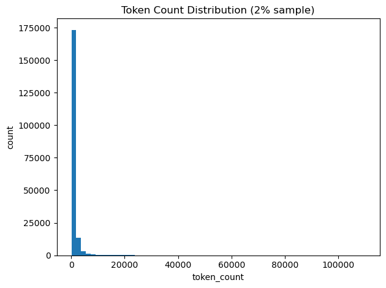
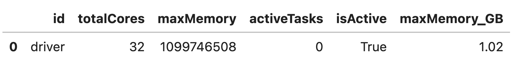

# FineWeb-Edu Large-Scale Analysis with Apache Spark

[](https://www.python.org/)
[](https://spark.apache.org/)
[](https://pandas.pydata.org/)
[](https://matplotlib.org/)
[](https://seaborn.pydata.org/)

## Project Description

This project analyzes the FineWeb-Edu (Sample-10BT) dataset using Apache Spark on SDSC Expanse High-performance computing (HPC). We explore 9.67 million educational web documents to understand data characteristics, quality distributions, and develop preprocessing strategies for educational content classification.

**Notebook:** [notebooks/01-data-exploration.ipynb](notebooks/01-data-exploration.ipynb)

---

## Dataset

We use the [FineWeb-Edu Sample-10BT](https://huggingface.co/datasets/HuggingFaceFW/fineweb-edu/viewer/sample-10BT) dataset from [HuggingFace](https://huggingface.co/datasets/HuggingFaceFW/fineweb-edu).

The dataset contains **9,672,101 educational web documents** stored in **14 Parquet files**.  
Data is processed using Apache Spark on SDSC Expanse due to its distributed format and scale.

---

## SDSC Expanse Setup

All work is performed on the SDSC Expanse high-performance computing cluster.

**Hardware Configuration:**

- **CPU Cores:** 8
- **Memory:** 128 GB per node

---

## SparkSession Configuration

```python
spark = SparkSession.builder \
    .config("spark.driver.memory", "2g") \
    .config("spark.executor.memory", "15g") \
    .config("spark.executor.instances", 7) \
    .getOrCreate()
```

### Justification

**Executor instances** = Total Cores - 1 = 8 - 1 = 7

**Executor memory** = (Total Memory - Driver Memory) / Executor Instances  
= (128GB - 2GB) / 7 ≈ 18GB

Executor memory was set to 15GB to allow memory overhead for Spark and JVM processes and to prevent out-of-memory errors.

### Spark UI Screenshot

Below is the DataFrame output showing multiple executors active during data loading:


---

## Data Exploration

### Number of Observations

The dataset contains **9,672,101 documents** in the FineWeb-Edu Sample-10BT subset.

---

### Column Descriptions

| Column           | Type    | Description          | Scale / Distribution   |
| ---------------- | ------- | -------------------- | ---------------------- |
| `id`             | string  | Document ID          | Unique identifier      |
| `text`           | string  | Document content     | Variable length        |
| `url`            | string  | Source URL           | Diverse domains        |
| `language`       | string  | Language             | Predominantly English  |
| `language_score` | float   | Language confidence  | 0–1 (mostly >0.95)     |
| `token_count`    | integer | Token count          | 1–170K, median ~629    |
| `score`          | float   | Quality score        | 2.5–5.34, median ~2.9  |
| `int_score`      | integer | Binned quality score | Buckets 3–5 (mostly 3) |

---

### Variable Types

- **Categorical variables:** `language`, `url`
- **Continuous variables:** `language_score`, `token_count`, `score`
- **Identifier column:** `id`
- **Target variable (planned):** `score` / `int_score` (educational quality)

---

### Missing and Duplicate Values

- No null values detected in core columns
- No duplicate records based on `id`
- Dataset is clean and suitable for modeling

---

### Distribution Insights

- **Token count** is highly right-skewed with median ~629 and mean ~1031 tokens, extending up to 170K tokens. This indicates high variability in document length.
- **Quality score** is moderately right-skewed, ranging from 2.5 to 5.34 with median ~2.9 and mean ~3.0. Most documents fall in quality bucket 3, with fewer in bucket 5.
- **Language distribution** is strongly dominated by English content.
- **Domain distribution** shows exceptional diversity with over 2 million unique sources. Top domains (Wikipedia, Britannica) each represent <1% of the total dataset.

---

### Spark Operations Used

The following Spark DataFrame operations were used:

- `df.count()` — Total observation count
- `df.printSchema()` — Schema inspection
- `df.describe().show()` — Summary statistics
- `df.groupBy().agg()` — Aggregations by quality bucket
- `df.select().distinct().count()` — Unique domain counts
- `df.dropDuplicates()` — Duplicate detection

---

## Data Visualizations

### 1. Documents per Quality Bucket (Bar Chart)


The majority of documents fall into quality bucket 3 (86.7%), followed by bucket 4 (13.2%), with very few in bucket 5 (0.08%). This confirms a severe class imbalance that must be considered during model training.

### 2. Top Domains (Bar Chart)

**Unique Domains:** 2,088,546


The dataset exhibits exceptional domain diversity with over 2 million unique sources. Top domains include educational websites (Wikipedia, Britannica), science news (Phys.org, ScienceDaily), and academic resources. Even the top domain (Wikipedia) represents <1% of total documents, confirming no single source dominates the dataset.

### 3. Token Count Distribution (Histogram)

**Note:** While the full dataset contains 9.6M documents, the visualizations below utilize a random 2% sample (~193K documents) to maintain performance while accurately representing the data distribution.



The token count distribution is heavily right-skewed. The median document length is ~629 tokens, while the mean (~1031 tokens) is larger due to a long tail extending up to 170K tokens. This indicates high variability in document length and suggests potential filtering or normalization during preprocessing.

### 4. Quality Score Distribution (Histogram)


The quality score ranges from approximately 2.5 to 5.34, with a median of ~2.9 and mean ~3.0. The distribution is moderately right-skewed, with most documents concentrated in the lower-to-mid score range (int_score = 3). Very high-quality documents (score bucket 5) are relatively rare.

---

## Preprocessing Plan

- **Filter invalid documents:** Use `df.filter()` to remove null or empty text fields, documents with fewer than 50 tokens, and documents shorter than 200 characters to reduce noise.

- **Remove duplicates:** Apply `dropDuplicates(["id"])` to ensure unique documents.

- **Feature engineering:** Extract domain names from URLs and create length-based categories from token_count.

- **Normalization:** Scale numeric features such as token_count and score to the [0,1] range using Spark ML preprocessing tools.

- **Handle class imbalance:** Since 86.7% of documents fall into quality bucket 3, we will consider stratified sampling or class weighting during model training.

- **Encoding:** Apply `StringIndexer` and `OneHotEncoder` to categorical variables if used in modeling.

---

## Milestone 3: Preprocessing & Distributed Model Training

**Notebook:** [notebooks/02-preprocessing-modeling.ipynb](notebooks/02-preprocessing-modeling.ipynb)

---

### Distributed Computing Setup

Training was performed on **SDSC Expanse** with the following Spark configuration:

```python
spark = SparkSession.builder \
    .config("spark.driver.memory", "2g") \
    .config("spark.executor.instances", "31") \
    .config("spark.executor.cores", "1") \
    .config("spark.executor.memory", "3g") \
    .getOrCreate()
```

- **Total cores:** 32 (1 driver + 31 executors)
- **Total memory:** ~128 GB

### Spark Executors



---

## Preprocessing Using Spark

The following preprocessing pipeline was implemented using **Spark** to efficiently process the large-scale FineWeb-Edu dataset (9.67M documents)

### 1. Filtering Invalid Documents and Sampling Clean Data

Invalid or low-information documents were removed to reduce noise in the dataset. 20% subset of Clean Data was then sampled for fast development,

Filtering criteria:

- Removed documents with **null or empty text fields**
- Removed documents with **fewer than 50 tokens**
- Removed documents with **text shorter than 200 characters**

Implementation used Spark's `df.filter()` with built-in SQL functions.

**Result:**

- Remaining documents: **1,935,821**
- Only 0.0003% of documents were removed, indicating the dataset was already very clean.

---

### 2. Removing Duplicate Documents

To ensure all documents are unique, duplicates were removed using:

```python
dropDuplicates(["id"])
```

Since the `id` field uniquely identifies each document, this guarantees that no duplicate records remain in the dataset.

---

### 3. Feature Engineering

New features were created using Spark SQL Functions to extract useful structural information from the dataset.

#### Domain Extraction

Domain names were extracted from URLs using `regexp_extract`.

Example:

```python
https://en.wikipedia.org/wiki/Spark
→ en.wikipedia.org
```

This feature can help capture information about document sources and content quality.

#### Document Length Categories

Documents were grouped into length buckets based on `token_count`:

- **Short:** < 500 tokens
- **Medium:** 500–2000 tokens
- **Long:** > 2000 tokens

These categories may improve model interpretability and allow the model to capture patterns related to document length.

Spark SQL functions used for feature engineering:

- `regexp_extract`
- `length`
- `when`
- `otherwise`

---

### 4. Feature Normalization

Continuous numerical features were normalized using MinMaxScaler, scaling values to the range **[0,1]**.

Normalized features:

- `token_count`
- `score`
- `language_score`

Normalization ensures features operate on comparable scales, which can improve the performance and stability of many machine learning models.

---

### 5. Handling Class Imbalance

The dataset exhibits a strong imbalance in quality score buckets:

| int_score | Documents | Percentage |
| --------- | --------- | ---------- |
| 3         | 1,678,010 | ~86.68%    |
| 4         | 256,326   | ~13.24%    |
| 5         | 1,485     | ~0.08%     |

To address this imbalance during model training, we plan to apply **stratified sampling** to downsample the majority class while preserving minority class examples. This approach helps prevent the model from becoming biased toward the dominant class.

---

## Machine Learning Pipeline

After preprocessing, a distributed **Spark ML pipeline** was constructed to transform the text data and train classification models.

The pipeline includes the following stages:

### RegexTokenizer

Splits raw document text into lowercase tokens using non-word characters as delimiters.

### StopWordsRemover

Removes common English stopwords to reduce noise and shrink the vocabulary.

### Word2Vec

Generates **10-dimensional word embeddings** from the filtered tokens to represent semantic information in the text.

### Imputer

Handles missing values in `token_count` using the **mean strategy**.

### VectorAssembler (Numeric Features)

Converts the imputed token count into a vector format required by Spark ML.

### StandardScaler

Standardizes the token count feature to have unit variance.

### VectorAssembler (Final Features)

Combines the **Word2Vec text embeddings** and **scaled numeric features** into the final `features` vector used by the model.

### RandomForestClassifier

Trains a distributed **Random Forest classifier** to predict document quality.

---

## Data Sampling and Train / Validation / Test Split

To reduce computational cost while maintaining class balance, a **two-step sampling strategy** was applied.

### 1% Subset for Training

A small subset of the dataset was used during experimentation to allow faster training iterations.

### Stratified Sampling

To address the strong class imbalance in `int_score`, stratified sampling was applied with the following fractions:

| Score | Fraction |
| ----- | -------- |
| 0     | 1.0      |
| 1     | 1.0      |
| 2     | 1.0      |
| 3     | 0.05     |
| 4     | 0.30     |

After sampling:

| int_score | Documents |
| --------- | --------- |
| 3         | 83,826    |
| 4         | 76,394    |

### Dataset Split

The sampled dataset was divided into:

| Dataset    | Size   |
| ---------- | ------ |
| Train      | 96,141 |
| Validation | 32,063 |
| Test       | 32,016 |

The **60 / 20 / 20 split** allows model training, hyperparameter tuning, and unbiased evaluation.

---

## Models

Two **Random Forest models** were trained to evaluate how increasing model capacity affects performance.

### Model 1 — Baseline Random Forest

**Hyperparameters**

`numTrees = 5`, `maxDepth = 2`

**Performance**

| Metric              | Value  |
| ------------------- | ------ |
| Train Accuracy      | 0.6219 |
| Validation Accuracy | 0.6197 |
| Test Accuracy       | 0.6189 |

This shallow model shows almost no overfitting but has limited predictive power.

---

### Model 2 — Deeper Random Forest

**Hyperparameters**

`numTrees = 20`, `maxDepth = 8`

**Performance**

| Metric              | Value  |
| ------------------- | ------ |
| Train Accuracy      | 0.6998 |
| Validation Accuracy | 0.6870 |
| Test Accuracy       | 0.6867 |

Increasing the number of trees and tree depth significantly improves model performance while maintaining acceptable generalization.

---

## Model Comparison

| Model                        | Train      | Validation | Test       |
| ---------------------------- | ---------- | ---------- | ---------- |
| RF (numTrees=5, maxDepth=2)  | 0.6219     | 0.6197     | 0.6189     |
| RF (numTrees=20, maxDepth=8) | **0.6998** | **0.6870** | **0.6867** |

The deeper Random Forest (**Model 2**) consistently performs better across all datasets.

---

## Best Model

The best performing model was:

`RandomForestClassifier (numTrees = 20, maxDepth = 8)`

**Test Accuracy**

`0.6867`

The trained model was saved to: `../models` directory

---

### Fitting Analysis

Model 1 sits near the **underfitting** end — a 0.30 pp train–test gap confirms good generalization but limited capacity. Model 2 introduces mild overfitting (1.31 pp gap) while delivering +6.78 pp test accuracy. Neither model is severely overfit; additional capacity and richer features are the primary levers for improvement in Milestone 4.

---

---

## Quick Setup

```bash

git clone https://github.com/mn-cs/fineweb-spark
cd fineweb-spark

```

---

## Documentation

- [Collaboration Guide](docs/COLLABORATION.md) - Team workflow and git instructions
